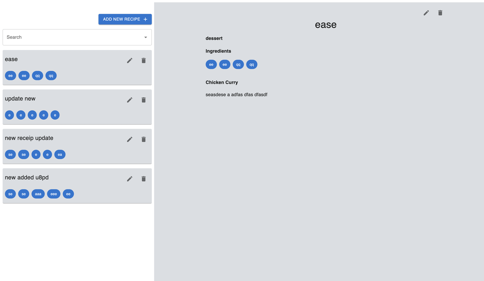

# Receip CRUD with NextJs and Node with Postgresql
<br/>

### [demo link](https://recipe-6b1buel5s-konyan.vercel.app/)

<br/>
<p align="center">

</p>


# RESTFul api with swigger documentation
<br/>

### [api documentation link](https://recipe-apo.onrender.com/api-docs/)

<br/>

<p align="center">

</p>


## Table of Contents

- [Recipe UI](#search-ui)
  - [Table of Contents](#table-of-contents)
  - [Installation](#installation)
  - [Usage](#usage)
  - [Cypress](#license)

## Installation

To install the project, you'll need to have Node.js and Yarn installed on your machine. Once you have those installed, follow these steps:

1. Clone the repository:

   ```
   git clone https://github.com/konyan/recipe-app
   ```

2. Install the dependencies:

   ```
   cd recipe-app
    cd client
    yarn install
    cd server
    yarn install
   ```

## Usage

To start the development server, you need to setup postgres db url first and then run the following command:

```
yarn start
```

To start client project, you need to go to client folder and then run commend:

```
yarn dev
```

To check the cypress test, use the following command:

```
yarn cypress
```